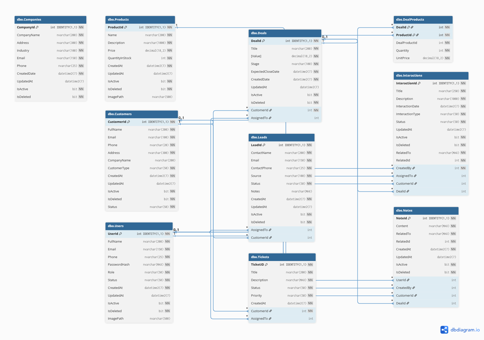

  

# 🌟 Smart CRM

Smart CRM is an ongoing (work-in-progress) Customer Relationship Management system built with **ASP.NET Core**, following **Clean Architecture** and a **Domain-Driven Design** approach.  
It provides tools to manage customers, deals, communications, activities, performance scoring, and team workflows — all designed for real-world business operations.

> **Note:** This project is currently under active development. Many features are being added and refined.

---

## ✅ Key Features (So far)

| Feature | Description |
|--------|-------------|
| **Customer Management** | Create, update, assign, and track customers with full details. |
| **Deals / Opportunities** | Manage sales pipeline with status tracking & values. |
| **Notes & Activities** | Log interactions, follow-ups, tasks & communication history. |
| **Customer Score Algorithm** | Calculates customer engagement score using dynamic weights. |
| **Soft Delete + Auditing** | All entities support CreatedBy, UpdatedBy & IsDeleted fields. |
| **Global Exception Handling Middleware** | Handles and formats API errors clearly and consistently. |
| **Repository + Unit of Work Pattern** | Clean and maintainable data access structure using EF Core. |
| **Validation Layer** | FluentValidation used to ensure cleaner input validation. |

---

## 🗂 Database ERD (Work in Progress)

> This is the current database structure visualization.  

  

---

## 🏛 Architecture Overview

This project follows **Clean Architecture** pattern:

SmartCRM.sln
│
├── 📦 SmartCRM.Domain → Entities, Value Objects, Interfaces
├── 🧠 SmartCRM.Application → UseCases, DTOs, Services, Business Logic
├── 🏗 SmartCRM.Infrastructure → EF Core, Repositories, UoW, DB Context
└── 🌐 SmartCRM.API → Controllers, Configurations, Middleware

Benefits:
- Clear separation of concerns
- Testable business logic
- Scalable and maintainable structure

---

## 🧮 Customer Score Algorithm (Example)

The system automatically calculates a customer score based on:

| Weight | Factor |
|-------|--------|
| 40%   | Number of deals |
| 40%   | Total deal value |
| 20%   | Activity recency |

This helps identify **high-value customers**, **inactive leads**, and **potential churn risks**.

---

## 🛠 Tech Stack

| Layer | Technology |
|------|------------|
| Backend | .NET 8 / ASP.NET Core Web API |
| Data Access | Entity Framework Core + SQL Server |
| Patterns | Clean Architecture, DDD, Repository + Unit of Work |
| Validation | FluentValidation |
| Logging | Built-in Logging + (Serilog planned) |
| Authentication | (Planned: Identity / JWT) |
| UI / Dashboard | (Planned: React / Next.js) |

---

## 🚧 Roadmap / Upcoming Features

- ✅ Add Customer Score service
- 🚧 Add Activities Calendar Dashboard
- 🚧 Add JWT Authentication & Roles
- 🚧 Add Notifications & Reminders
- 🚧 Add Reporting & Analytics
- 🔜 Full Modern UI Dashboard

---

## 🤝 Contributions

This project is still being actively developed.  
If you'd like to contribute, feel free to open issues or PRs after the repository goes public.

---

## 📌 Status

> **Project Status:** Under Development 👷‍♂️  
> More updates will be published soon.

---

## 🧑‍💻 Author

**Smart CRM** — Designed & Developed by *Muhammed Wagdy*  
**📧 Email:** mohamed5wagdy@gmail.com.com
**🔗 LinkedIn:** https://linkedin.com/in/muhammed-fouda
**📞 Phone:** +20 1554503750

